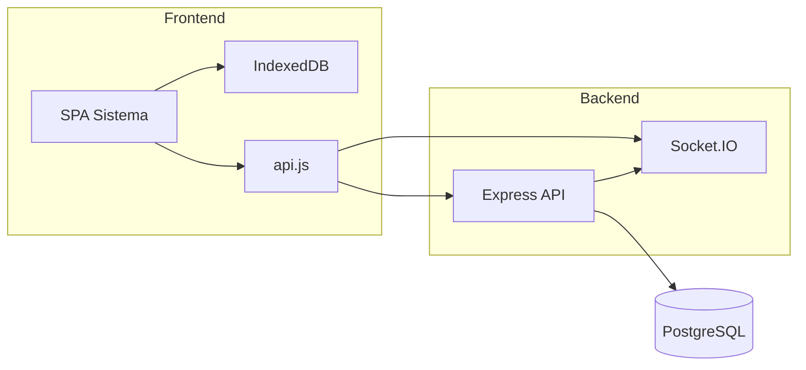

# Opal & Co - Sistema POS

Sistema POS multisucursal para retail (joyería): inventario, ventas (POS), clientes, reparaciones, llegadas de turistas, proveedores, caja, costos, reportes y dashboard. Funciona con sincronización offline-first (IndexedDB) y backend en tiempo real (Express + Socket.IO + PostgreSQL).

## Descripción

- **Frontend**: SPA en HTML/CSS/JavaScript (Tailwind), almacenamiento local IndexedDB y comunicación con el API REST y Socket.IO.
- **Backend**: API Express (Node.js), autenticación JWT, middleware de autenticación opcional (token o headers por sucursal), PostgreSQL como base de datos.
- **Multisucursal**: sucursales, empleados y usuarios con roles (employee, manager, admin, master_admin) y permisos por sucursal.
- **Módulos**: Dashboard, POS, Caja, Códigos de barras, Inventario, Transferencias, Clientes, Reparaciones, Llegadas turistas, Empleados, Catálogos, Sucursales, Proveedores, Reportes, Costos, Sincronización, Configuración.

## Requisitos

- **Node.js** (v18+ recomendado)
- **PostgreSQL** (para el backend)
- Variables de entorno en backend: `DATABASE_URL`, opcionalmente `ALLOWED_ORIGINS` o `CORS_ORIGIN`, `JWT_SECRET`, etc.

## Cómo ejecutar

### Backend

```bash
cd backend
npm install
# Configurar .env con DATABASE_URL y demás variables
npm run dev
```

Por defecto el servidor escucha en el puerto definido en `process.env.PORT` o 3001.

### Frontend

El frontend son archivos estáticos. Opciones:

- Servir con un servidor local (evita restricciones de `file://`):
  ```bash
  cd Sistema
  npm install
  npm start
  ```
  Abre `http://localhost:3000`.

- Desplegar en Vercel (o similar) como sitio estático desde la carpeta `Sistema/`.

### Despliegue

- **Backend**: preparado para Railway (Dockerfile, Procfile, railway.json, nixpacks.toml). Configurar en Railway `DATABASE_URL`, `ALLOWED_ORIGINS` (o `CORS_ORIGIN`) con la URL del frontend.
- **Frontend**: en Configuración > Sincronización se define la URL del API (p. ej. `https://tu-app.railway.app`).

## Diagrama de alto nivel



## Documentación completa

La documentación técnica por módulos y áreas está en **[docs/README.md](docs/README.md)**. Ahí se listan todos los documentos (arquitectura, base de datos, autenticación y permisos, inventario, ventas-POS, clientes y servicios, empleados y sucursales, proveedores, caja-costos-reportes, sincronización, configuración y frontend core).

## Estructura del repositorio

- `backend/`: API Express, rutas, middleware, Socket.IO, configuración BD, scripts de migración.
- `Sistema/`: frontend (index.html, css/, js/, assets/, libs/).
- `docs/`: documentación en Markdown y scripts de verificación (p. ej. sincronización).
